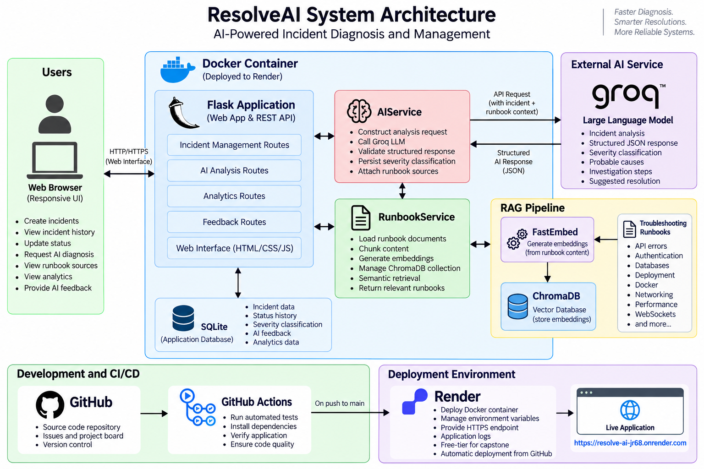

# ResolveAI

**AI-Powered Software Incident Diagnosis and Management Platform**

ResolveAI helps software developers diagnose, investigate, and manage software incidents by combining structured incident tracking, AI-assisted diagnosis, and retrieval-augmented generation (RAG) over troubleshooting runbooks.

The platform allows developers to record an incident, provide logs or error information, retrieve relevant troubleshooting knowledge, and receive a structured AI diagnosis containing severity, probable causes, investigation steps, and suggested resolutions.

## Live Application

**ResolveAI:** https://resolve-ai-jr68.onrender.com

> The application is hosted on a free-tier Render instance. The service may spin down after inactivity, so the first request can take additional time while the application starts.

---

## Features

### Incident Management

- Create software incidents
- View incident history
- View individual incident details
- Update incident status
- Track incidents through Open, Investigating, and Resolved states
- Search incidents by title and description
- Filter incidents by status

### AI-Powered Diagnosis

ResolveAI analyzes incident descriptions and logs and produces structured diagnostic information including:

- incident summary
- severity classification
- incident category
- probable causes
- investigation steps
- suggested resolution

### Retrieval-Augmented Generation

ResolveAI grounds AI analysis using a troubleshooting runbook knowledge base.

The RAG pipeline:

1. loads Markdown troubleshooting runbooks;
2. divides documents into overlapping chunks;
3. generates embeddings using FastEmbed;
4. stores embeddings and source metadata in ChromaDB;
5. embeds incident information during diagnosis;
6. performs semantic similarity search;
7. provides relevant runbook context to the LLM; and
8. displays retrieved runbook sources with the diagnosis.

### Incident Analytics

The dashboard provides:

- total incident count
- Open incident count
- Investigating incident count
- Resolved incident count
- severity distribution

### AI Feedback

Users can rate AI diagnoses as:

- Helpful
- Not Helpful

Feedback is persisted with the corresponding incident and provides a foundation for evaluating AI recommendation usefulness.

---

## System Architecture



ResolveAI uses a layered architecture consisting of:

- responsive web interface
- Flask web application and REST API
- SQLAlchemy persistence layer
- SQLite database
- AI analysis service
- runbook retrieval service
- FastEmbed embedding model
- ChromaDB vector database
- Groq LLM API
- Docker deployment
- GitHub Actions continuous integration
- Render cloud hosting

Detailed architecture and design decisions are documented in:

[`docs/design-and-testing.md`](docs/design-and-testing.md)

---

## Technology Stack

| Area                   | Technology                    |
| ---------------------- | ----------------------------- |
| Language               | Python                        |
| Web Framework          | Flask                         |
| ORM                    | Flask-SQLAlchemy              |
| Database               | SQLite                        |
| LLM Provider           | Groq                          |
| LLM                    | `openai/gpt-oss-20b`          |
| Embeddings             | FastEmbed                     |
| Embedding Model        | `BAAI/bge-small-en-v1.5`      |
| Vector Database        | ChromaDB                      |
| Testing                | Pytest                        |
| Production Server      | Gunicorn                      |
| Containerization       | Docker                        |
| Continuous Integration | GitHub Actions                |
| Deployment             | Render                        |
| Frontend               | HTML, CSS, Vanilla JavaScript |

---

## Troubleshooting Knowledge Base

ResolveAI currently includes runbooks covering:

- API errors
- Authentication
- Database incidents
- Deployment
- Docker
- Networking
- Performance
- WebSockets

Runbooks are stored in:

```text
runbooks/
```

The vector database is generated automatically when the knowledge base is required in a fresh environment. Generated vector-store files are not committed to the repository.

---

## API Overview

### Health

```http
GET /api/health
```

### Create Incident

```http
POST /api/incidents
```

Example request:

```json
{
  "title": "Production API returning 502 errors",
  "description": "Users are receiving 502 Bad Gateway responses.",
  "logs": "Connection refused while connecting to upstream"
}
```

### List Incidents

```http
GET /api/incidents
```

Search and filtering are supported through query parameters.

Example:

```http
GET /api/incidents?search=production&status=Open
```

### Get Incident

```http
GET /api/incidents/<incident_id>
```

### Update Incident Status

```http
PATCH /api/incidents/<incident_id>/status
```

Example:

```json
{
  "status": "Investigating"
}
```

### Analyze Incident

```http
POST /api/incidents/<incident_id>/analyze
```

The response contains structured AI analysis and retrieved runbook sources.

### Submit AI Feedback

```http
POST /api/incidents/<incident_id>/feedback
```

Example:

```json
{
  "helpful": true
}
```

### Analytics

```http
GET /api/analytics
```

---

## Local Development

### 1. Clone the repository

```bash
git clone https://github.com/folarmi/resolve-ai.git
cd resolve-ai
```

### 2. Create a virtual environment

```bash
python -m venv .venv
source .venv/bin/activate
```

### 3. Install dependencies

```bash
pip install -r requirements.txt
```

### 4. Configure environment variables

Copy the example environment configuration:

```bash
cp .env.example .env
```

Configure:

```text
GROQ_API_KEY=your_groq_api_key
GROQ_MODEL=openai/gpt-oss-20b
DATABASE_URL=sqlite:///resolveai.db
```

Never commit the real `.env` file.

### 5. Start the application

```bash
python -m app.app
```

Open:

```text
http://localhost:5001
```

---

## Running Tests

Activate the virtual environment and run:

```bash
python -m pytest -v
```

The completed ResolveAI test suite contains:

**32 passing automated tests**

Testing covers:

- incident creation
- input validation
- incident retrieval
- not-found handling
- status updates
- status validation
- search
- filtering
- AI analysis behavior
- RAG source attribution
- analytics
- severity persistence
- AI feedback
- feedback validation

Detailed testing rationale and results are available in:

[`docs/design-and-testing.md`](docs/design-and-testing.md)

---

## Docker

Build the application image:

```bash
docker build -t resolveai .
```

Run the container:

```bash
docker run --rm \
  -p 5001:5001 \
  --env-file .env \
  resolveai
```

Then open:

```text
http://localhost:5001
```

The Docker deployment automatically initializes the runbook vector store when required.

---

## Continuous Integration

ResolveAI uses GitHub Actions for continuous integration.

The workflow runs for pushes and pull requests targeting `main` and performs:

1. repository checkout;
2. Python environment setup;
3. dependency installation; and
4. execution of the automated Pytest suite.

The CI pipeline is defined in:

```text
.github/workflows/ci.yml
```

The completed CI workflow successfully executes the ResolveAI automated test suite.

---

## Agile Development

ResolveAI was developed using an iterative Agile process based on Scrum principles.

The core functionality was delivered across **three development sprints**.

### Sprint 1 — Incident Management Foundation

User stories:

- US-001 — Create an incident
- US-002 — View incident history
- US-003 — Update incident status

Outcome:

A tested incident-management foundation with **11 passing tests**.

### Sprint 2 — AI Diagnosis and Runbook Retrieval

User stories:

- US-004 — Analyze an incident with AI
- US-005 — Retrieve troubleshooting runbooks

Outcome:

Structured AI diagnosis, semantic runbook retrieval, RAG integration, and source attribution.

### Sprint 3 — Incident Management Features and AI Feedback

User stories:

- US-006 — Search and filter incidents
- US-007 — View incident analytics
- US-008 — Rate AI diagnosis

Outcome:

Completed core feature scope and expanded the automated suite to **32 passing tests**.

Sprint reviews are available in:

[`docs/sprint-reviews.md`](docs/sprint-reviews.md)

Development tasks and user stories are tracked through the **ResolveAI Capstone Board** in GitHub Projects.

---

## Deployment

ResolveAI is containerized using Docker and deployed to Render using Gunicorn.

Production configuration uses:

```text
workers: 1
timeout: 180 seconds
```

The extended timeout accommodates first-time embedding model initialization in the resource-constrained free hosting environment.

The deployed system has been verified end-to-end for:

- incident creation
- incident retrieval
- status management
- AI diagnosis
- semantic runbook retrieval
- runbook source attribution
- analytics
- AI feedback

---

## Project Documentation

| Document                                                   | Description                                                                                                                                |
| ---------------------------------------------------------- | ------------------------------------------------------------------------------------------------------------------------------------------ |
| [`docs/design-and-testing.md`](docs/design-and-testing.md) | Architecture, technology choices, design decisions, testing strategy, deployment analysis, Agile methodology, limitations, and conclusions |
| [`docs/sprint-reviews.md`](docs/sprint-reviews.md)         | Sprint goals, completed work, testing, and sprint outcomes                                                                                 |
| [`docs/architecture.png`](docs/architecture.png)           | ResolveAI system architecture diagram                                                                                                      |

---

## Project Scope

ResolveAI intentionally focuses on demonstrating the core incident-management and AI diagnosis workflow.

The capstone does not currently include:

- authentication and authorization
- multi-tenancy
- automated infrastructure monitoring
- Slack or messaging integrations
- GitHub incident ingestion
- Kubernetes integrations
- automatic remediation
- multi-agent orchestration

These capabilities represent potential areas for future development rather than requirements of the current prototype.

---

## Security and Configuration

Sensitive configuration is supplied using environment variables.

The following files and generated artifacts are excluded from version control:

```text
.env
instance/*.db
instance/*.sqlite
vectorstore/
```

API credentials must never be committed to the repository.

---

## Capstone Status

**Core implementation complete and deployed.**

- 3 Agile development sprints completed
- 8 core user stories delivered
- 32 automated tests passing
- GitHub Actions CI passing
- Docker container verified
- AI + RAG verified in container
- Public Render deployment verified
- Architecture documented
- Design and testing documentation completed
